# EdgeYOLO-FPGA

> **Hardware-accelerated quantized YOLO for real-time object detection on FPGA using custom RTL, SystemVerilog, and verification.**

> Blueprint diagrams are stored in `assets/diagrams/` and render directly in GitHub.

EdgeYOLO-FPGA is an end-to-end hardware acceleration project that explores how a lightweight YOLO object detector can be mapped from a software reference implementation to a quantized, FPGA-oriented architecture.

The project covers the full path from **AI / Computer Vision** to **Digital Hardware Design**:

**YOLO → Quantization → Golden Model → Hardware Architecture → RTL → Verification → FPGA → Benchmarking**

---

## Project Goals

The main objectives are:

- Train or fine-tune a lightweight YOLO model for a selected object-detection task.
- Quantize the inference pipeline for hardware-friendly execution.
- Build a bit-accurate software reference model.
- Design a reusable hardware accelerator for compute-intensive YOLO operations.
- Implement the accelerator in SystemVerilog.
- Verify the RTL against the software golden model.
- Synthesize and deploy the design on FPGA.
- Measure accuracy, latency, throughput, resource utilization, and power.
- Compare software and hardware implementations.

---

## High-Level Architecture

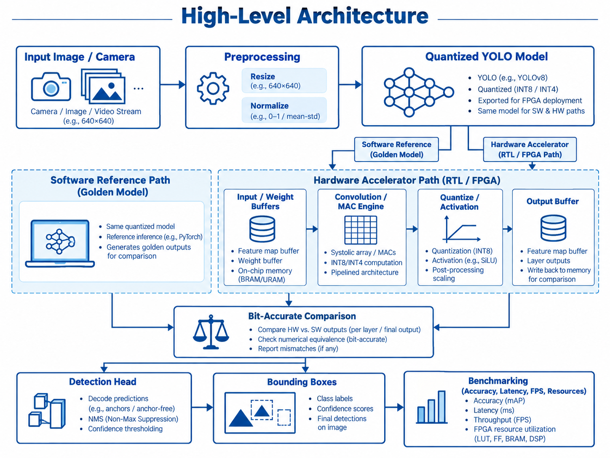

---

# Development Roadmap

## Phase 0 — Project Definition

**Goal:** Define a realistic and measurable hardware-acceleration target.

- [ ] Select the object-detection use case.
- [ ] Select the dataset.
- [ ] Select a lightweight YOLO model.
- [ ] Define target FPGA board.
- [ ] Define target precision: INT8 initially.
- [ ] Define target input resolution.
- [ ] Define minimum acceptable detection accuracy.
- [ ] Define target FPS / latency.
- [ ] Define FPGA resource budget.
- [ ] Document all initial design constraints.

### Deliverables

```text
docs/
├── project_scope.md
├── hardware_target.md
└── performance_targets.md
```

---

## Phase 1 — YOLO Baseline

**Goal:** Establish a reproducible floating-point software baseline.

- [ ] Set up the training/inference environment.
- [ ] Prepare the dataset.
- [ ] Train or fine-tune the selected YOLO model.
- [ ] Evaluate detection performance.
- [ ] Export representative test samples.
- [ ] Measure baseline inference latency.
- [ ] Save baseline model checkpoints.

### Metrics

- mAP
- Precision
- Recall
- Model size
- CPU/GPU inference latency
- FPS

### Deliverables

```text
ai/
├── train/
├── inference/
├── datasets/
├── checkpoints/
└── results/
```

---

## Phase 2 — Quantization

**Goal:** Convert the floating-point model into a hardware-friendly representation.

Initial target:

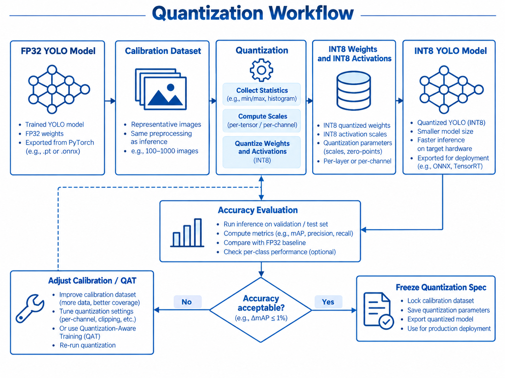

Possible future experiments:

- INT4
- Mixed precision
- Per-tensor quantization
- Per-channel quantization

- [ ] Identify quantization-sensitive layers.
- [ ] Quantize weights.
- [ ] Quantize activations.
- [ ] Define scale / zero-point handling.
- [ ] Evaluate quantized accuracy.
- [ ] Compare FP32 and quantized outputs.
- [ ] Freeze the quantization specification for RTL.

### Required Comparison

| Metric | FP32 | INT8 |
|---|---:|---:|
| mAP | TBD | TBD |
| Precision | TBD | TBD |
| Recall | TBD | TBD |
| Model Size | TBD | TBD |
| Latency | TBD | TBD |

### Deliverables

```text
quantization/
├── quantize.py
├── calibration/
├── exported_weights/
├── test_vectors/
└── quantization_spec.md
```

---

## Phase 3 — Bit-Accurate Golden Model

**Goal:** Create the reference implementation used to verify the RTL.

The golden model must reproduce the exact arithmetic expected from hardware.

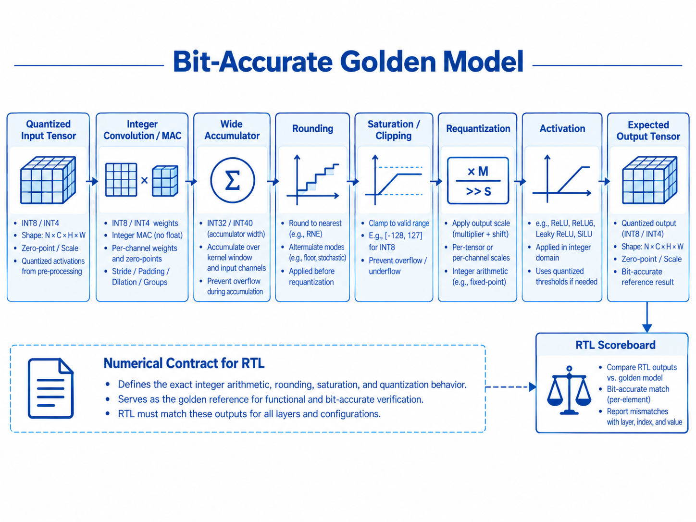

The same arithmetic rules used here become the numerical contract for the RTL implementation.

- [ ] Implement integer convolution.
- [ ] Implement accumulator behavior.
- [ ] Implement rounding.
- [ ] Implement saturation / clipping.
- [ ] Implement activation behavior.
- [ ] Implement quantized rescaling.
- [ ] Generate deterministic RTL test vectors.
- [ ] Export expected intermediate feature maps.

### Important

The golden model should explicitly define:

- Bit width
- Signed / unsigned representation
- Accumulator width
- Overflow behavior
- Rounding mode
- Saturation behavior
- Quantization scale handling

### Deliverables

```text
golden_model/
├── layers/
├── fixed_point/
├── reference_inference.py
├── generate_vectors.py
└── tests/
```

---

# Phase 4 — Hardware Architecture

**Goal:** Design the hardware accelerator before writing production RTL.

Initial accelerator focus:

> **Parameterized convolution engine for YOLO workloads**

Possible architecture:

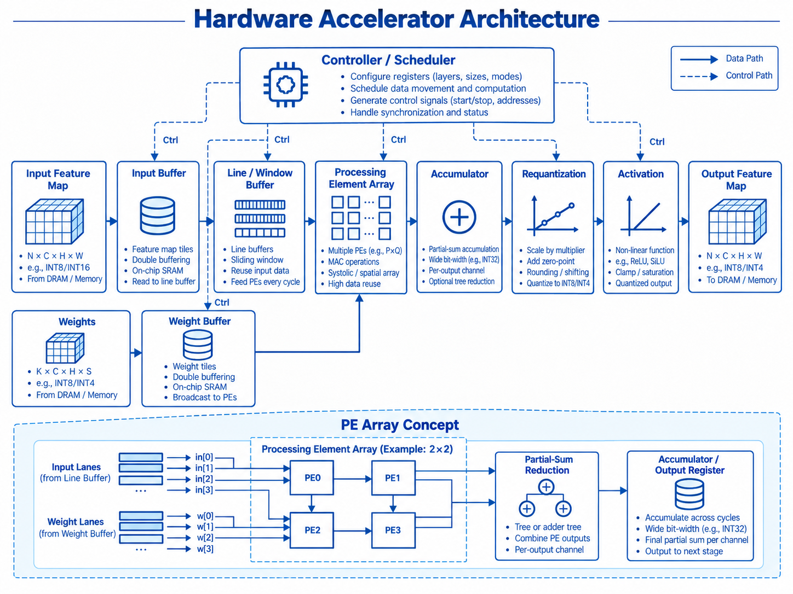

### PE Array Concept

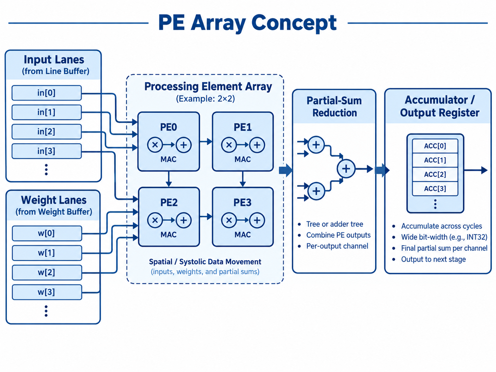

## Architecture Parameters

- Input feature-map dimensions
- Output feature-map dimensions
- Input channels
- Output channels
- Kernel size
- Stride
- Padding
- Parallel MAC count
- Processing-element count
- Input precision
- Weight precision
- Accumulator precision

### Dataflow Exploration

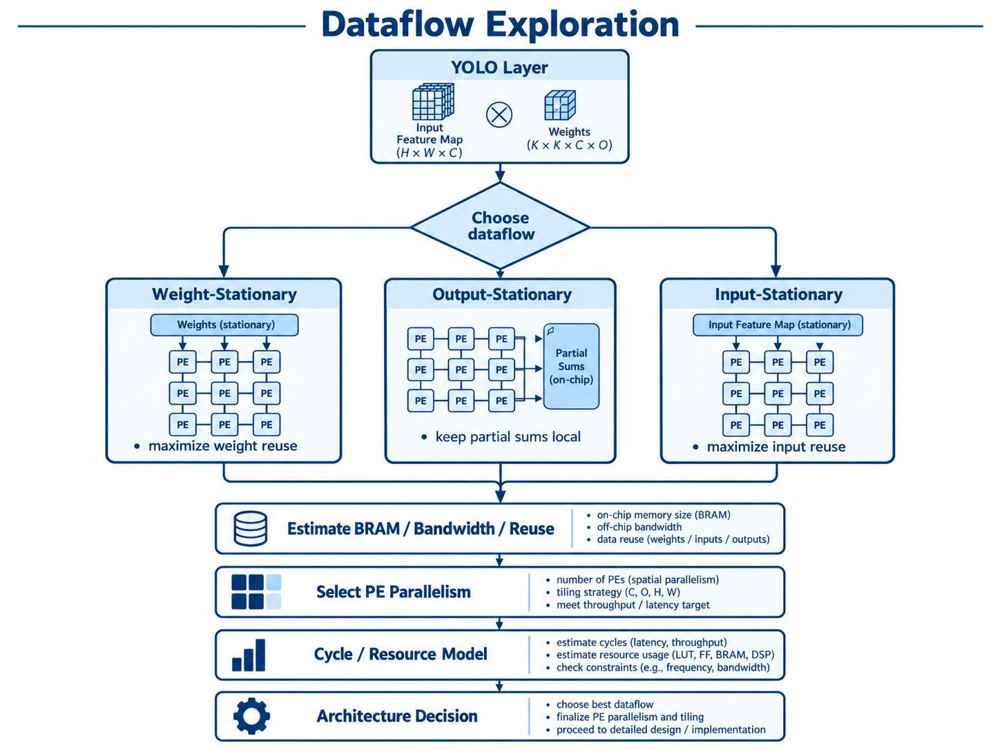

## Design Questions

- [ ] Direct convolution or transformed architecture?
- [ ] Output-stationary, weight-stationary, or input-stationary dataflow?
- [ ] How many MAC operations per cycle?
- [ ] How are weights buffered?
- [ ] How are feature maps buffered?
- [ ] What is the external memory bandwidth requirement?
- [ ] What is the BRAM requirement?
- [ ] Where is pipelining required?
- [ ] What is the target initiation interval?
- [ ] How will backpressure be handled?

### Deliverables

```text
docs/architecture/
├── accelerator_overview.md
├── dataflow.md
├── memory_architecture.md
├── fixed_point_format.md
└── diagrams/
```

---

# Phase 5 — SystemVerilog RTL

**Goal:** Implement the accelerator as reusable, parameterized RTL.

Proposed module structure:

```text
rtl/
├── top/
│   └── edgeyolo_accelerator.sv
│
├── compute/
│   ├── mac_unit.sv
│   ├── processing_element.sv
│   ├── pe_array.sv
│   ├── accumulator.sv
│   └── activation_unit.sv
│
├── memory/
│   ├── input_buffer.sv
│   ├── weight_buffer.sv
│   ├── output_buffer.sv
│   └── line_buffer.sv
│
├── control/
│   ├── controller.sv
│   └── scheduler.sv
│
├── interface/
│   ├── stream_input.sv
│   ├── stream_output.sv
│   └── register_interface.sv
│
└── common/
    ├── fifo.sv
    └── edgeyolo_pkg.sv
```

### RTL Module Hierarchy

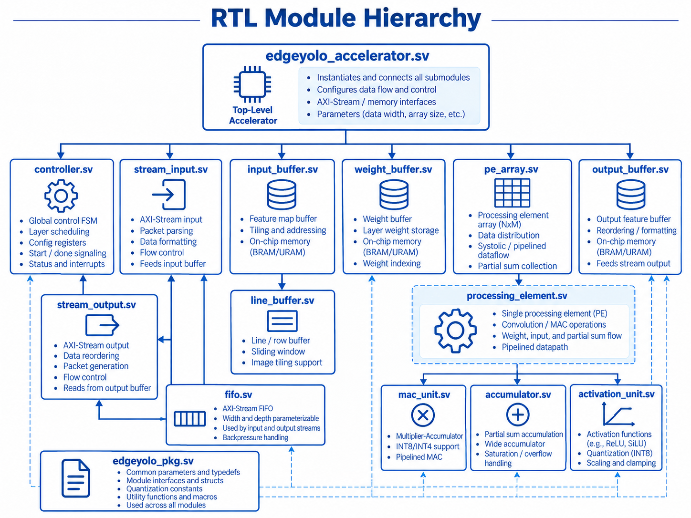

## RTL Milestones

- [ ] MAC unit
- [ ] Processing element
- [ ] PE array
- [ ] Input buffer
- [ ] Weight buffer
- [ ] Line buffer
- [ ] Accumulator
- [ ] Quantization / requantization block
- [ ] Activation unit
- [ ] Controller
- [ ] Streaming interface
- [ ] Accelerator top module
- [ ] Timing-clean pipelining

---

# Phase 6 — Verification

**Goal:** Verify functional correctness before FPGA implementation.

Verification strategy:

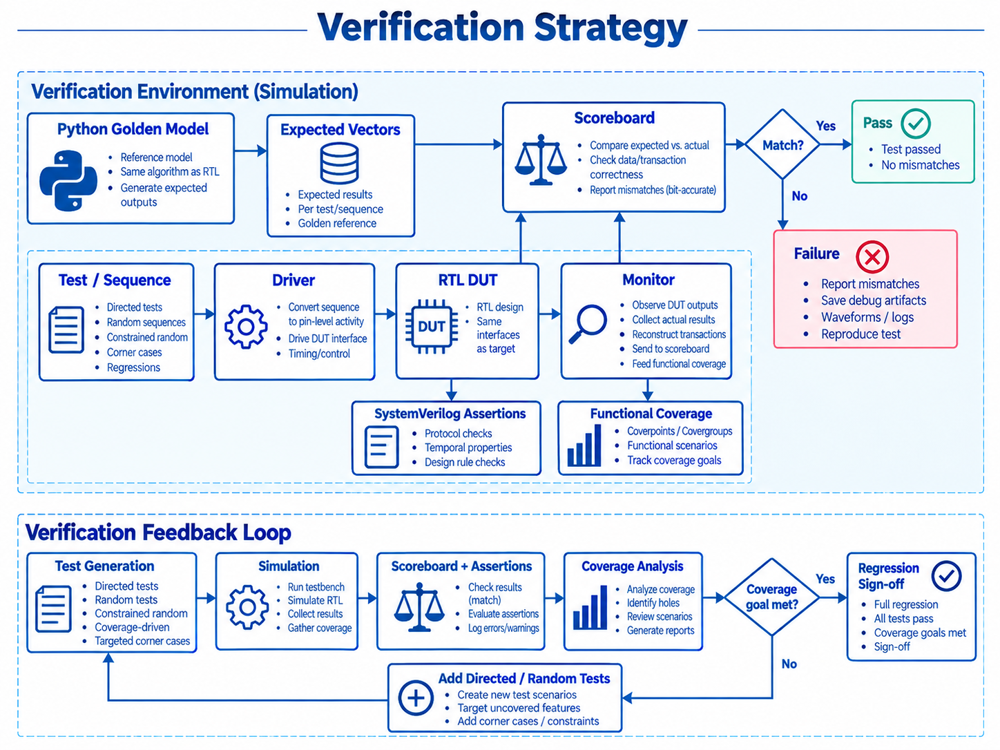

### Verification Feedback Loop

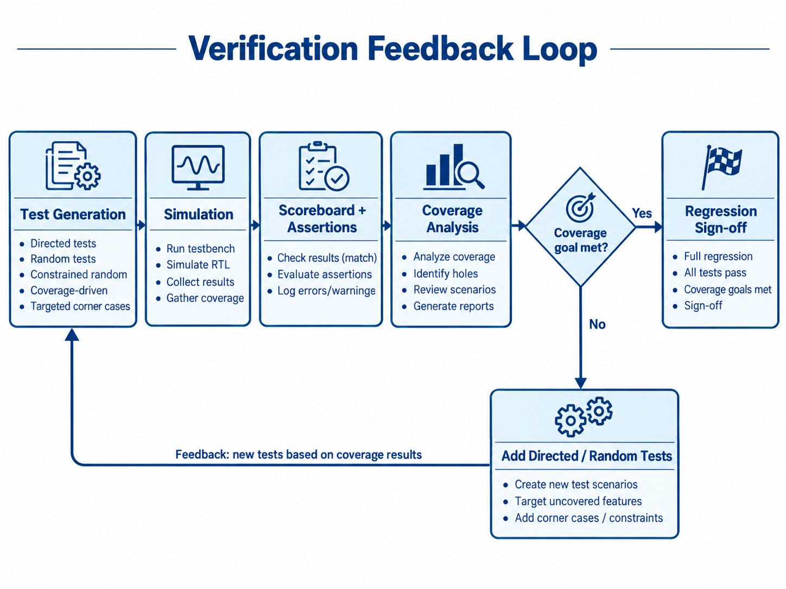

## Verification Features

- Directed tests
- Randomized tests
- Corner-case testing
- Assertions
- Functional coverage
- Scoreboard-based checking
- Bit-accurate comparison against Python
- Pipeline latency verification
- Flow-control verification
- Reset behavior verification

## Test Categories

- [ ] Zero input
- [ ] Minimum values
- [ ] Maximum values
- [ ] Positive overflow
- [ ] Negative overflow
- [ ] Random feature maps
- [ ] Random weights
- [ ] Different kernel configurations
- [ ] Different channel counts
- [ ] Different feature-map sizes
- [ ] Backpressure
- [ ] Reset during operation
- [ ] Multiple consecutive transactions

## SystemVerilog Assertions

Potential properties:

- Valid/ready protocol correctness
- No output without valid input
- FIFO overflow prevention
- FIFO underflow prevention
- Stable data under backpressure
- Correct transaction completion
- Reset-state correctness

## Coverage

Track:

- Kernel configurations
- Quantized value ranges
- Saturation events
- Channel configurations
- Buffer boundary conditions
- Control-state transitions

### Deliverables

```text
verification/
├── tb/
├── drivers/
├── monitors/
├── scoreboard/
├── assertions/
├── coverage/
├── vectors/
└── regression/
```

---

# Phase 7 — FPGA Synthesis & Implementation

**Goal:** Map the verified RTL design to FPGA.

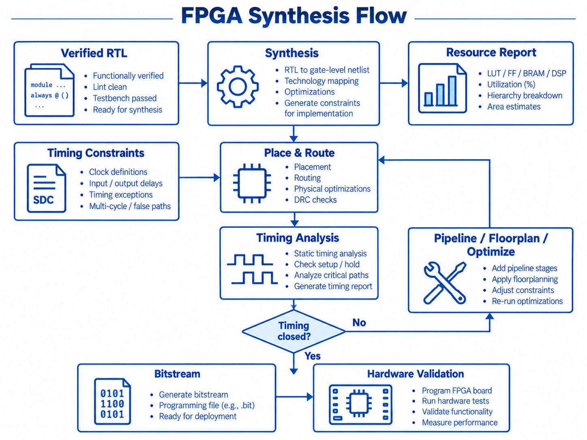

- [ ] Create FPGA project.
- [ ] Add timing constraints.
- [ ] Run synthesis.
- [ ] Review inferred hardware.
- [ ] Run implementation.
- [ ] Fix timing violations.
- [ ] Analyze resource utilization.
- [ ] Analyze critical paths.
- [ ] Generate bitstream.
- [ ] Run hardware smoke tests.

## Target Reports

- LUT usage
- FF usage
- BRAM usage
- DSP usage
- Maximum frequency
- Worst negative slack
- Total power
- Dynamic power
- Static power

### FPGA Results

| Resource | Used | Available | Utilization |
|---|---:|---:|---:|
| LUT | TBD | TBD | TBD |
| FF | TBD | TBD | TBD |
| BRAM | TBD | TBD | TBD |
| DSP | TBD | TBD | TBD |

| Timing Metric | Result |
|---|---:|
| Target Clock | TBD MHz |
| Achieved Clock | TBD MHz |
| WNS | TBD ns |

---

# Phase 8 — YOLO Integration

**Goal:** Integrate the accelerator with the actual YOLO inference pipeline.

Possible first integration strategy:

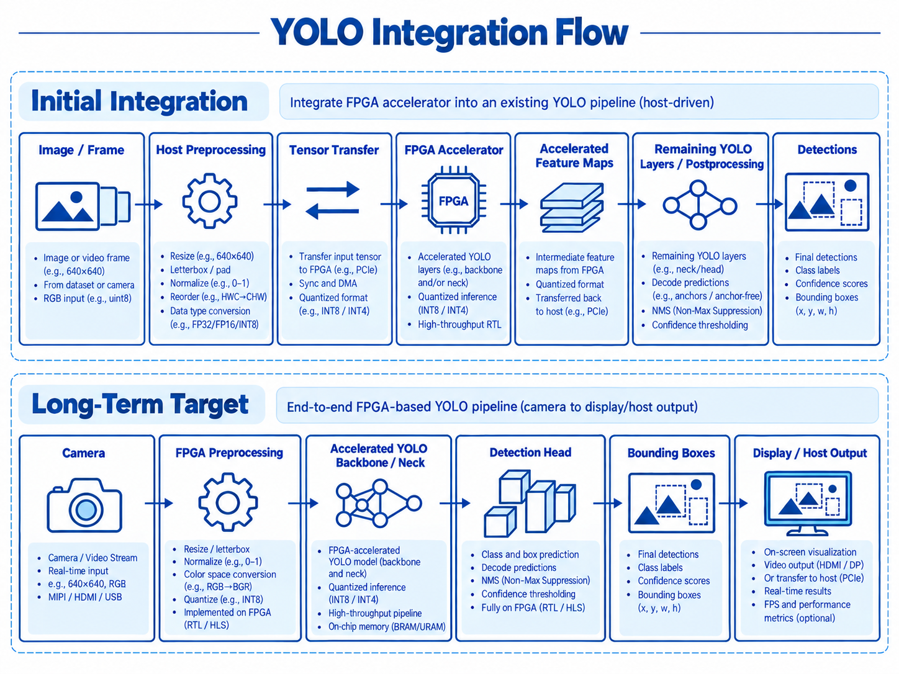

Long-term target:

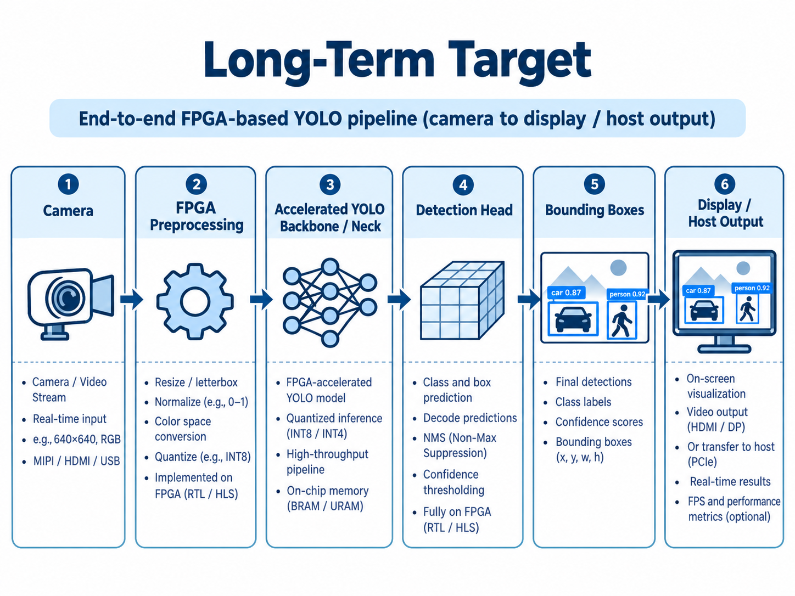

- [ ] Export model weights.
- [ ] Map supported layers to accelerator.
- [ ] Implement runtime control.
- [ ] Move tensors between host and FPGA.
- [ ] Verify end-to-end numerical correctness.
- [ ] Run detection on real images.
- [ ] Measure end-to-end latency.

---

# Phase 9 — Real-Time Demo

**Goal:** Demonstrate the system visually.

Possible demo pipeline:

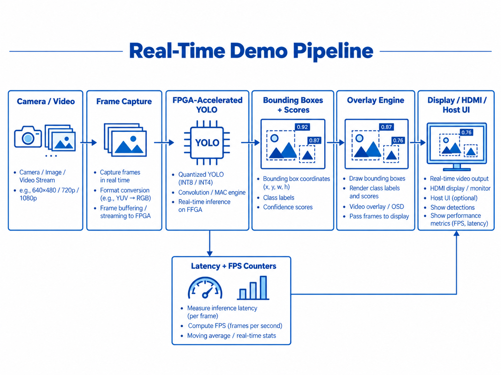

Demo requirements:

- [ ] Live or prerecorded video input
- [ ] Real detections
- [ ] Bounding-box visualization
- [ ] FPS counter
- [ ] Latency measurement
- [ ] Demo video for GitHub / LinkedIn

---

# Phase 10 — Benchmarking

**Goal:** Quantify whether hardware acceleration is useful.

Compare:

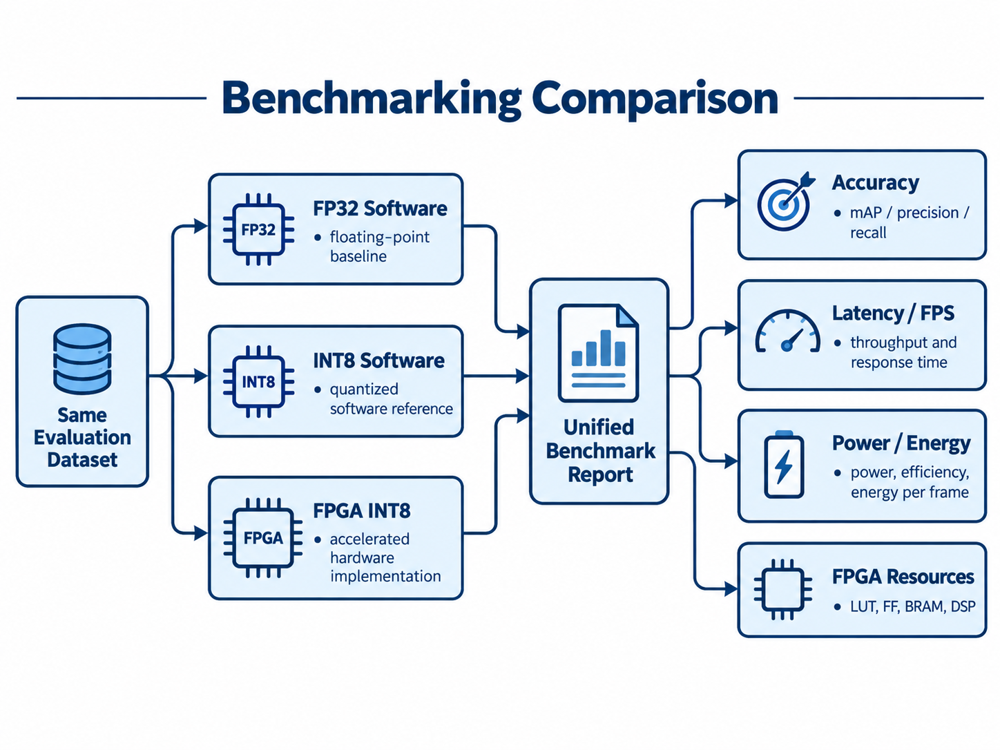

The three paths must use the same evaluation inputs and clearly documented preprocessing whenever possible.

## Final Benchmark Table

| Implementation | mAP | Latency | FPS | Power | LUT | FF | BRAM | DSP |
|---|---:|---:|---:|---:|---:|---:|---:|---:|
| FP32 Software | TBD | TBD | TBD | TBD | — | — | — | — |
| INT8 Software | TBD | TBD | TBD | TBD | — | — | — | — |
| FPGA INT8 | TBD | TBD | TBD | TBD | TBD | TBD | TBD | TBD |

Additional metrics:

- GOPS
- GOPS/W
- GOPS/DSP
- Frames/Joule
- Memory bandwidth
- Accelerator utilization

---

# Phase 11 — Optimization

Possible optimization directions:

- [ ] Increase PE parallelism.
- [ ] Improve pipeline utilization.
- [ ] Double buffering.
- [ ] Better weight reuse.
- [ ] Better feature-map reuse.
- [ ] Memory burst optimization.
- [ ] Layer fusion.
- [ ] INT4 experiments.
- [ ] Mixed precision.
- [ ] Sparse computation.
- [ ] Clock-frequency optimization.
- [ ] Resource-sharing experiments.

Each optimization should be evaluated using the same scorecard:

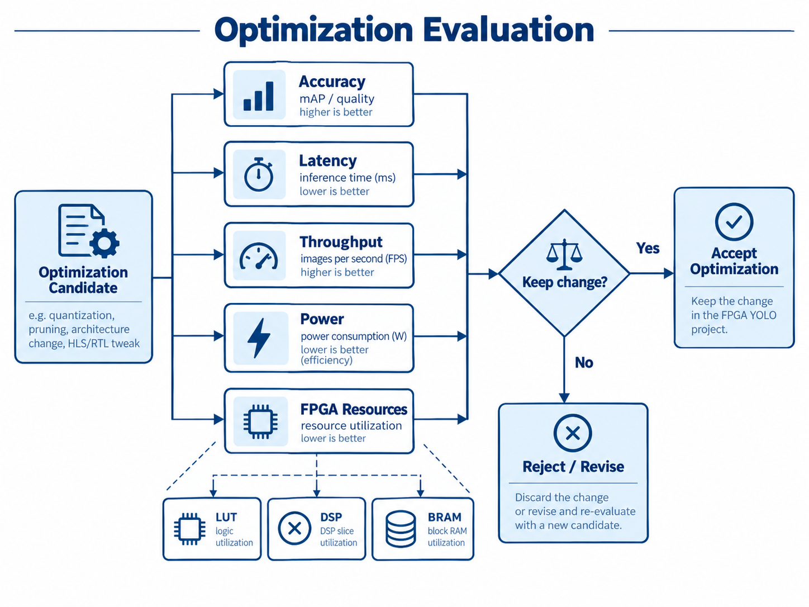


---

# Verification Philosophy

This project treats verification as a first-class design requirement.

Every major hardware block should pass through:

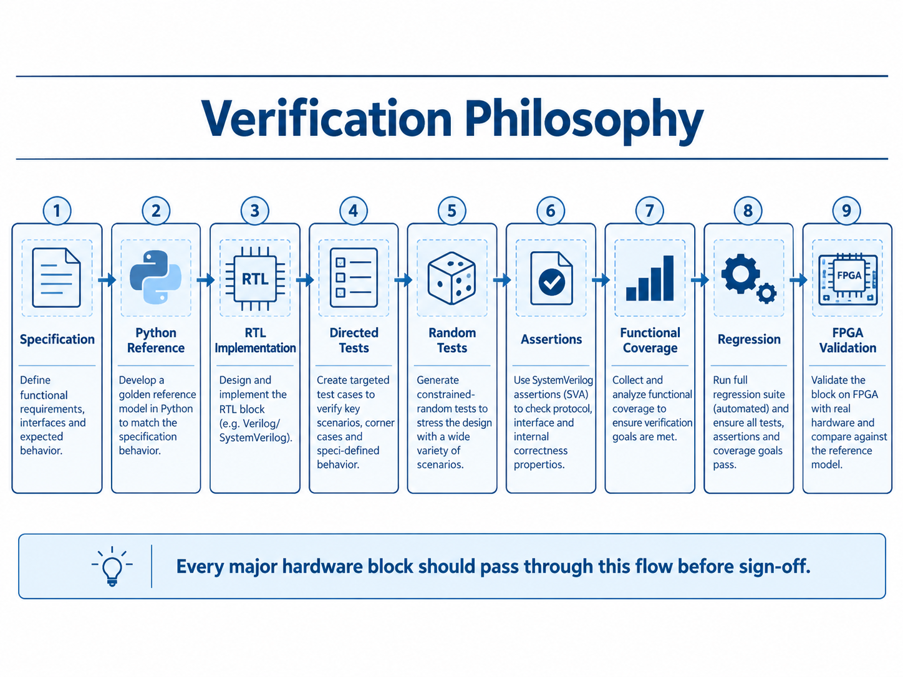

The FPGA implementation should not be considered complete until the hardware results match the fixed-point reference model within the explicitly defined arithmetic rules.

---

# Repository Structure

Planned structure:

```text
edgeyolo-fpga/
│
├── README.md
├── LICENSE
│
├── ai/
│   ├── train/
│   ├── inference/
│   └── checkpoints/
│
├── quantization/
│   ├── calibration/
│   ├── exported_weights/
│   └── test_vectors/
│
├── golden_model/
│   ├── fixed_point/
│   ├── layers/
│   └── tests/
│
├── rtl/
│   ├── top/
│   ├── compute/
│   ├── memory/
│   ├── control/
│   ├── interface/
│   └── common/
│
├── verification/
│   ├── tb/
│   ├── assertions/
│   ├── coverage/
│   ├── scoreboard/
│   └── regression/
│
├── fpga/
│   ├── constraints/
│   ├── scripts/
│   └── reports/
│
├── benchmark/
│   ├── software/
│   ├── hardware/
│   └── results/
│
├── demo/
│   ├── images/
│   ├── videos/
│   └── scripts/
│
└── docs/
    ├── architecture/
    ├── verification/
    └── results/
```

---

# Milestone Overview

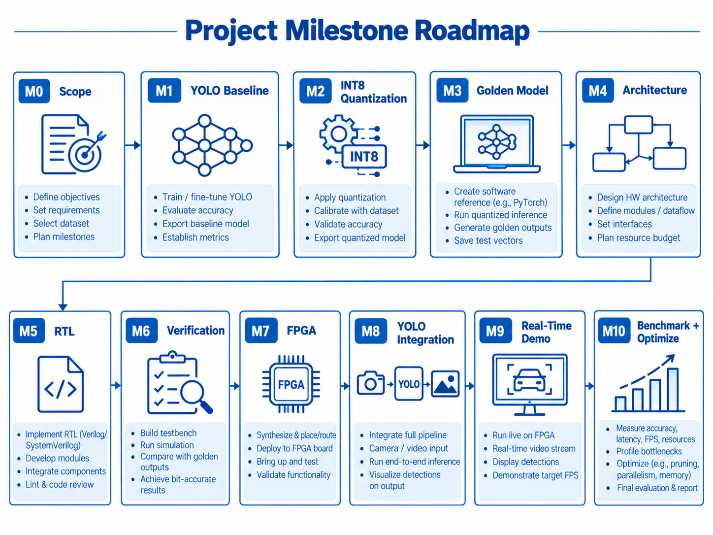

| Milestone | Description | Status |
|---|---|---|
| M0 | Project specification | ⬜ |
| M1 | YOLO software baseline | ⬜ |
| M2 | INT8 quantization | ⬜ |
| M3 | Bit-accurate golden model | ⬜ |
| M4 | Accelerator architecture | ⬜ |
| M5 | Core RTL implementation | ⬜ |
| M6 | RTL verification | ⬜ |
| M7 | FPGA synthesis | ⬜ |
| M8 | YOLO integration | ⬜ |
| M9 | Real-time demo | ⬜ |
| M10 | Benchmark & optimization | ⬜ |

---

# Minimum Viable Flagship Version

The first complete version does **not** need to implement the entire YOLO network in custom RTL.

A strong initial milestone is:

> **Quantized YOLO + custom convolution accelerator + bit-accurate SystemVerilog verification + FPGA synthesis + end-to-end benchmark**

This provides a realistic path to a finished project while still demonstrating:

- Computer Vision
- Deep Learning
- Quantization
- Hardware Acceleration
- Computer Architecture
- RTL Design
- SystemVerilog
- Functional Verification
- FPGA Design
- Performance Analysis

---

# Stretch Goals

After the first working version:

- Full accelerator support for additional YOLO layers
- End-to-end FPGA inference
- Camera input
- HDMI output
- DMA integration
- AXI-based SoC integration
- Multi-core accelerator
- Mixed-precision arithmetic
- Sparsity support
- Quantization-aware training
- Runtime-programmable layer configuration
- Comparison against GPU / CPU / embedded accelerator
- Publishable technical report

---

# Final Project Success Criteria

The project is considered successful when:

- [ ] The quantized model achieves acceptable detection accuracy.
- [ ] The RTL output matches the golden model.
- [ ] Verification covers normal and corner-case behavior.
- [ ] The accelerator successfully synthesizes.
- [ ] Timing closure is achieved.
- [ ] FPGA inference is demonstrated.
- [ ] Performance is measured reproducibly.
- [ ] Results are documented with real numbers.
- [ ] The repository contains architecture and verification documentation.
- [ ] A reproducible demo is available.

---

# Target Skill Coverage

This project is intentionally designed to demonstrate an intersection of:

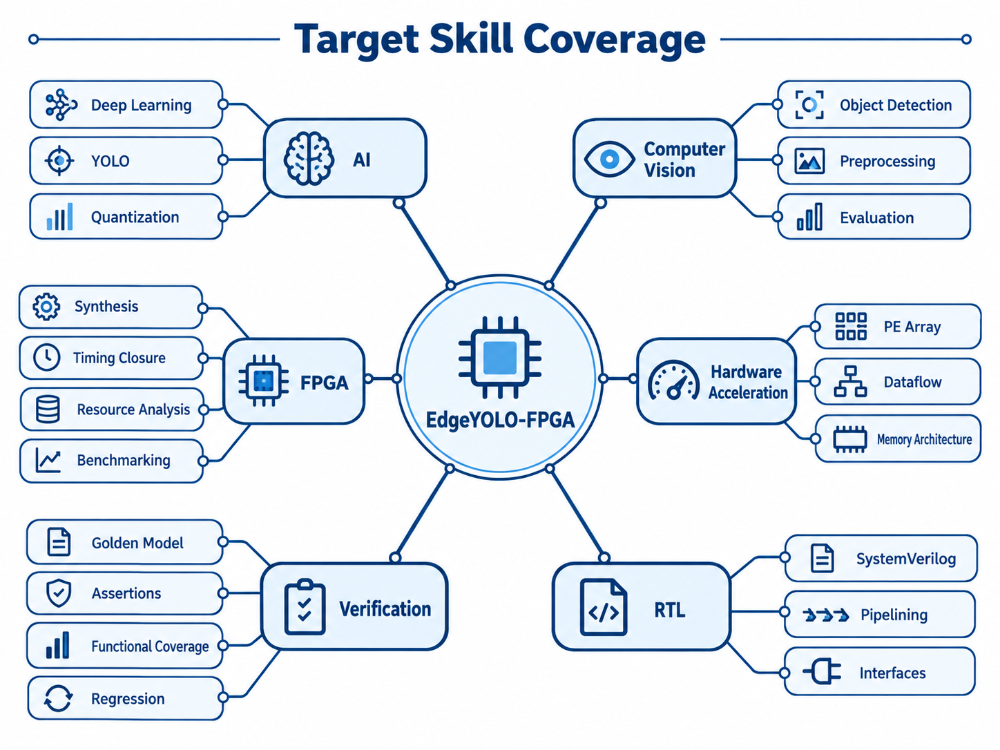

---

# Status

🚧 **Work in progress**

Current phase:

> **Phase 0 — Project Definition**

---

# License

A license will be selected before publishing reusable source code.

